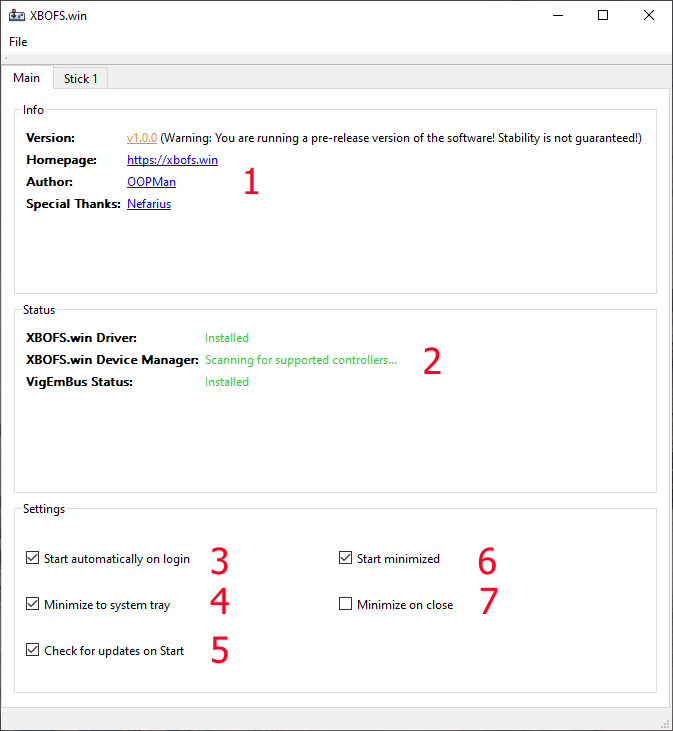
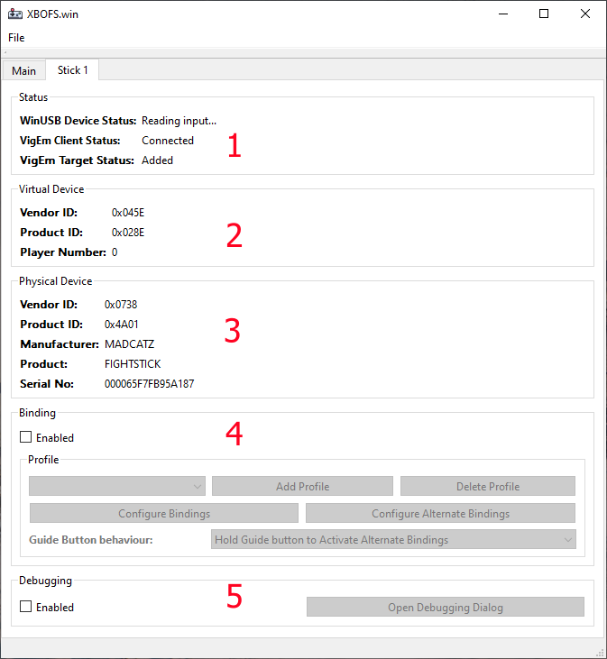

# A Guided Tour of XBOFS.win

This page will take you on a quick tour of the **XBOFS.win** application.

Let's start with the Main tab...

1. The *Info* area displays basic information about the application along with some clickable links
2. The *Status* area displays information pertaining to the XBOFS.win WinUSB driver and Device Manager as well as VigEmBus
3. This checkbox controls whether the application is started automatically when you logon to Windows
4. This checkbox determines whether the application minimizes to the taskbar or the system tray
5. This checkbox determines whether the application will check for updates on start-up. In order for this functionality to
   work the [Win64 OpenSSL Light](http://slproweb.com/products/Win32OpenSSL.html) distribution needs to be installed
6. This checkbox controls whether or not the application starts minimized or not. If the application is configured to minimize to 
   to system tray, the application will start minimized to that location
7. This checkbox controls whether closing the application window causes the application to minimize instead. If this feature is
   enabled the only way to exit the application is using the *File* menu

Each attached Fight Stick that is recognized will receive a Stick tab:

1. The *Status* area displays basic information about the status of the Fight Stick
2. The *Virtual Device* area displays some basic diagnostic information about the Virtual XB360 controller created for the Fight Stick 
3. The *Physical Device* area displays basic diagnostic information about the Fight Stick
4. The *Binding* area is used to activate, deactivate or configure custom bindings for the Fight Stick. [Click here](/binding_guide.md) to read more about this feature
5. The *Debugging* area is used to interact with the debugging feature. [Click here](/debugging_guide.md) to read more about this feature

