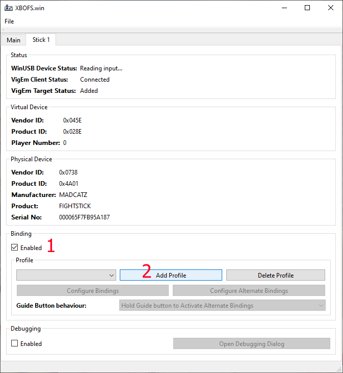
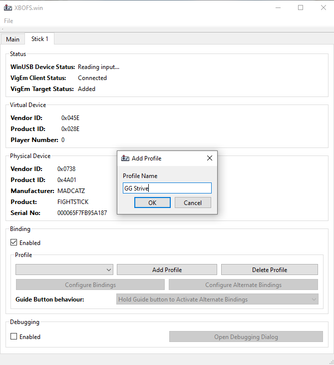
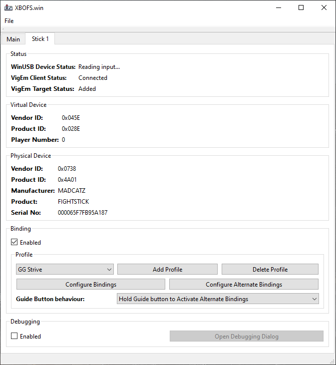
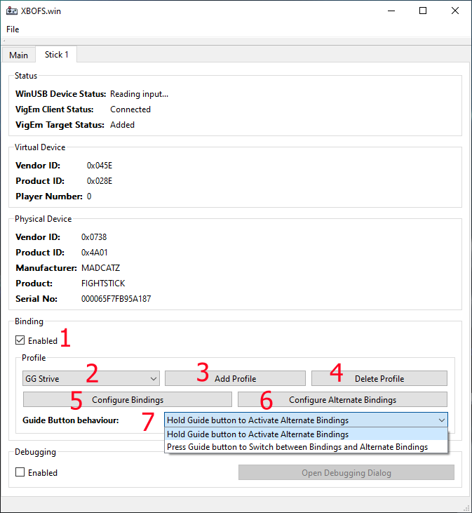
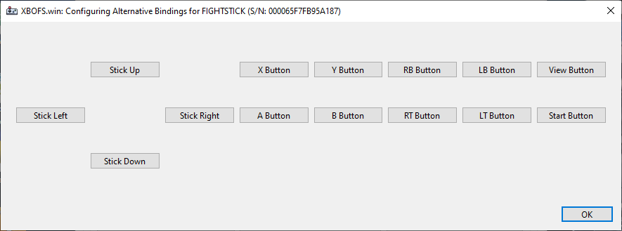
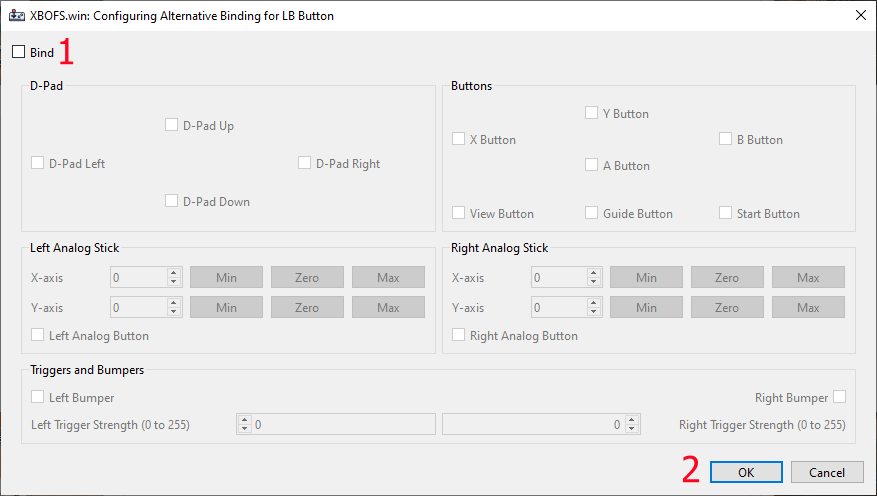
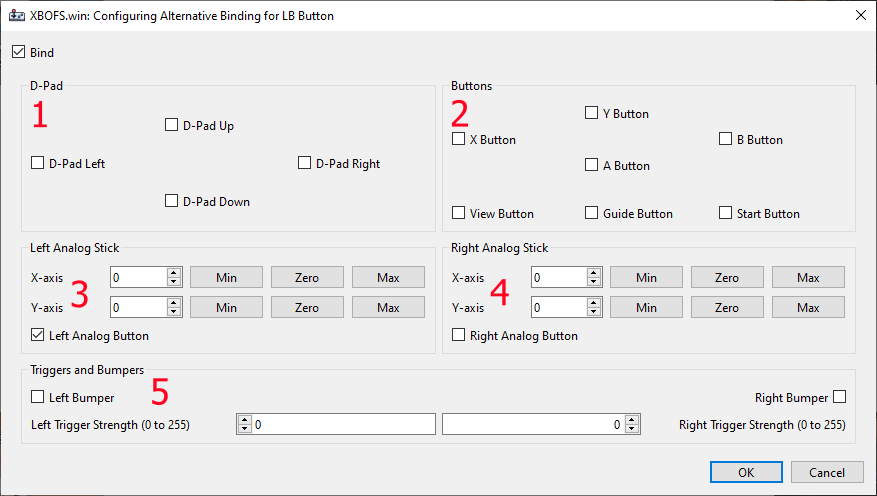

# Control Binding Guide
The Control Binding system allows you to customize the mapping of input data received from your attached **XBO Fight Stick** to the 
input data sent to the **Virtual XBox 360 Controller**. 

Control Bindings are configured using profiles. Multiple profiles can be created and each profile can define its own mappings. This
allows you to configure specific profiles for specific applications. 

Profile information is associated with a specific **XBO Fight Stick** by way of its unique hardware information (Manufacturer, Product 
and Serial Number). This means that no matter what order you plug in your **XBO Fight Sticks** the correct profile information will
always be loaded for that device.

The Control Binding system also introduces the concept of alternate bindings. Simply put, this enables you to configure two different
bindings for a given control on your **XBO Fight Stick**. Access to the alternate binding for a given control is provided by the
**XBox Guide Button** which has been repurposed to function as a modifier button, similar to the *Shift* key on your keyboard.

The utility of the Control Binding system may not immediately obvious but once you consider that whereas a **XBO Fight Stick** provides 
15 unique inputs (11 buttons and 4 directions) the **Virtual XBox 360 Controller** has many more (2 analog thumbsticks, 2 analog triggers, 
4 directions and 11 buttons) the possibilities might be a little clearer, especially when you consider that certain games only
function correctly when analog directional input data is received...

Finally, as a **XBO Fight Stick** user you may have concerns as to whether or not the Control Binding system as has any performance impact
on the flow of data from your device to the software you are using. You can rest easy in the knowledge that due to optimizations introduced
in v1.0.0 of **XBOFS.win** there is no impact terms of performance when using the Control Binding system.

Without further ado, let's explore!

## First Steps
In order to enable the Control Binding system for your **XBO Fight Stick** the *Binding* checkbox needs to be enabled in the *Device tab* 
for your **XBO Fight Stick** and a Profile needs to be added.

1. The *Binding* checkbox
2. The *Add Profile* button

Clicking the Add Profile button will present a dialog allowing you to enter a name for the Profile. The name of your profile must not
exceed 256 characters, if it does the trailing characters will be removed.

Once you have created a profile the remaining elements of the Control Binding interface become available.

## Control Binding interface
This section will provide a quick run-through of the whole Control Binding interface.

1. The *Binding* checkbox controls whether the Control Binding system is enabled or disabled. When disabled no other controls in the
   Control Binding interface will be usable
2. The *Profile* drop-down allows you to select the active set of Control Bindings
3. The *Add Profile* button is used to create a new Control Binding configuration. If you create a new profile with the same name
   as a previously deleted profile the application will simply restore that previously deleted profile
4. the *Remove Profile* button is removed to remove an existing Control Binding configuration
5. The *Configure Bindings* button will open the binding configuration dialog
6. The *Configure Alternate Bindings* button will open the alternate binding configuration dialog
7. Finally, the *Guide Button Behaviour* drop-down is used to configure the behaviour of the XBox Guide Button with regards to 
   activating the alternate control bindings. 

   By default the alternate control bindings are activated while the XBox Guide Button is held down, very similar to the *Shift* 
   key on a keyboard.

   The second behaviour option for the XBox Guide Button is a toggle-mode. In this mode the XBox Guide Button behaves similarly to
   the *Caps Lock* key on a keyboard, each press-and-release will cause the control bindings to switch between regular and alternate
   bindings

## Binding Configuration Dialog

The Binding Configuration dialog presents you with a visual representation of the controls available for binding on the 
**XBO Fight Stick**.  

The title for this dialog will reflect the details of device being configured as well as whether the regular or alternate
bindings are being configured.

The *XBox Guide Button* is not available in this dialog as when Control Binding is enabled the behaviour of the said button
is used to control whether regular or alternate bindings are active.

Clicking on a control button in this dialog will open the Control Binding dialog for that button.

## Control Binding Dialog
The Control Binding dialog is used to configure the input data that will be sent to the **Virtual XBox 360 Controller** when 
the given button or direction is received from the **XBO Fight Stick**. 

Note that the title for this dialog will indicate which button on the **XBO Fight Stick** is being configured and whether the
regular or alternate binding is being configured. 

1. The *Bind* checkbox controls whether the button being configured will use a custom binding. In the event that this checkbox is 
   not checked, the default binding will be used. The default bindings are as follows:

   * Stick Up binds to D-Pad Up
   * Stick Down binds to D-Pad Down
   * Stick Left binds to D-Pad Left
   * Stick Right binds to D-Pad Right
   * A Button binds to A Button
   * B Button binds to B Button
   * X Button binds to X Button
   * Y Button binds to Y Button
   * LB Button binds to Left Bumper
   * RB Button binds to Right Bumper
   * LT Button binds to Left Trigger with a Strength of 255
   * RT Button binds to Right Trigger with a Strength of 255
   * Start Button binds to Start Button
   * View Button binds to View Button

   The default alternate bindings are as above with one exception:

   * View Button binds to Guide Button

2. Clicking the *Ok* button will cause the configuration to be saved whereas the *Cancel* button will discard the configuration.
   The application will then return to the [Binding Configuration Dialog](#binding-configuration-dialog) dialog

When *Bind* is checked the remaining controls in the dialog become enabled:

1. The *D-Pad* section handles the binding of D-Pad directional inputs
2. The *Buttons* section handles the binding of the large majority of the other button-style inputs, including the
   Guide Button
3. The *Left Analog Stick* section handles binding of the X and Y axis of the left thumbstick as well as the left thumbstick button 
   input
4. The *Right Analog Stick* section handles binding of the X and Y axis of the right thumbstick as well as the right thumbstick button 
   input
5. The *Triggers and Bumpers* handles binding of the left and right triggers and bumpers

##### Notes on the Left/Right Analog Stick sections
* The minimum value for a given axis is -32768
 
  * For the X-axis this corresponds to the left-most position of the thunmbstick
  * For the Y-axis this corresponds to the bottom-most position of the thumbstick
  
* The maximum value for a given axis is  32767
  
  * For the X-axis this corresponds to the right-most position of the thumbstick
  * For the Y-axis this corresponds to the upper-most position of the thumbstick
  
* The spinner controls on the inputs increment/decrement the value in steps of 8192

##### Notes on the Triggers and Bumpers section
* The minimum trigger strength value is 0, which corresponds to the trigger being free
* The maximum trigger strength value is 255, which corresponds to the trigger being held completely
* The spinner controls on the inputs increment/decrement the value in steps of 255

## Sample Configurations
The sample configurations list below exist to give you an idea as to what the Control Binding system
can be used for.

### Guilty Gear Strive

* Alternative bindings

  * LB button is bound to Left Analog Button
  * LT button is bound to Right Analog Button

The purpose of this configuration is to allow the Left and Right analog buttons to be used in
the Training mode to trigger the Start Recording and Stop Recording actions. 

Fun fact, this configuration was the reason I did all the work on the Control Binding system
as GG Strive's inability to allow multiple button bindings to be used to trigger the Start/Stop
Recording actions made it impossible for me to use the Recording function in Training without
overriding other bindings which annoyed me a lot.

### Mortal Kombat 11

* Guide Button behaviour set to Toggle
* Alternative bindings

  * Stick Up is set to Left Analog Stick Y-axis 32767
  * Stick Down is set to Left Analog Stick Y-axis -32768
  * Stick Left is set to Left Analog Stick X-axis -32768
  * Stick Right is set to Left Analog Stick X-axis 32767
  * RB is set to Right Analog stick X-axis -32768
  * LB is set to Right Analog stick X-axis 32767

The purpose of this configuration is to allow the Fight Stick to be used to navigate in the Krypt
mode. The Kyrpt mode uses the Left Analog Stick for movement while the Right Analog Stick controls the
camera. Looking up and down is not that important but being able to rotate the view left and right is.
This configuration allows you to switch to the Alternate bindings and navigate the game world in the
Krypt mode without needing to plug in a normal game controller. When you want to play the rest of the
game you switch back to the Regular bindings.

