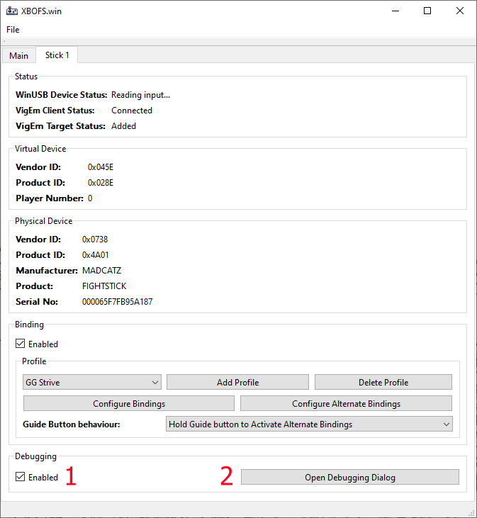
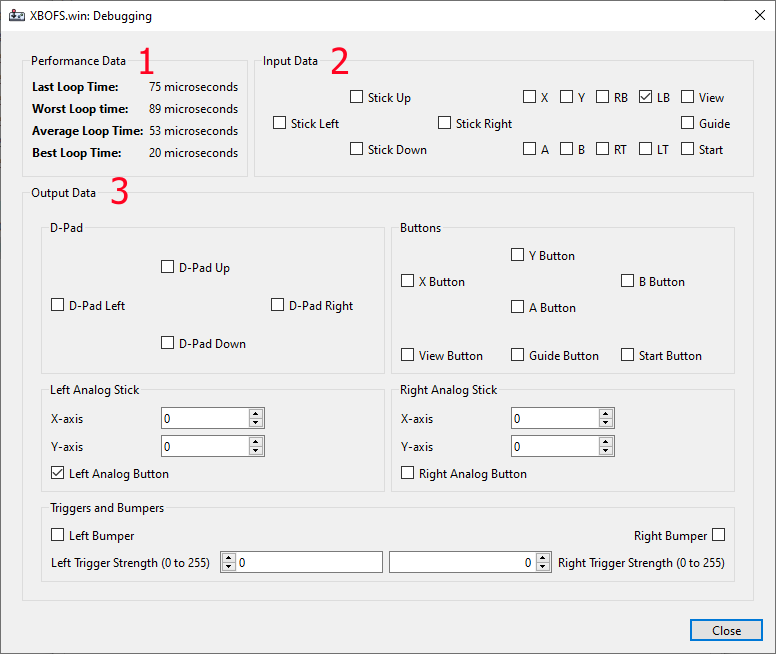

# Debugging Guide
The debugging component allows you to view performance data related to the core input processing loop as
well as displaying button state information which can be useful to confirm that your binding configuration
without needing to load a proper game.

1. The *Debugging* checkbox is used to enable or disable this feature. Enabling the debugging feature causes
   the application to use a different code pathway which tracks performance and submits data to the user interface.
   When the debugging feature is disabled the regular code pathway is used and no performance tracking or data submission
   to the user interface occurs
2. With debugging enabled, the *Open Debugging Dialog* button is enabled and is used to open the debugging dialog

1. The *Performance Data* section displays measurements pertaining to the time the application spends from the point of
   receiving input data from the **XBO Fight Stick** to the point at which it finishes sending input data to the
   **Virtual Xbox 360 Controller**. These measurements are displayed in microseconds (For reference, 1000 microseconds = 1 millisecond)
2. The *Input Data* section displays input data received from the **XBO Fight Stick**
3. The *Output Data* section displays input data sent to the **Virtual XBox 360 Controller**
