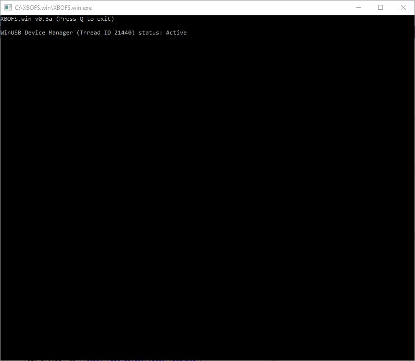
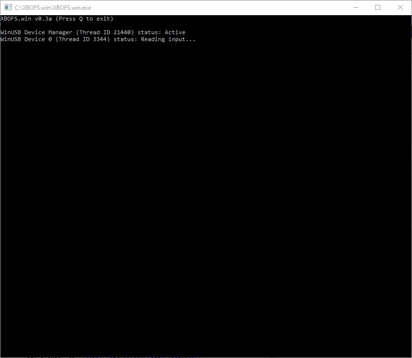
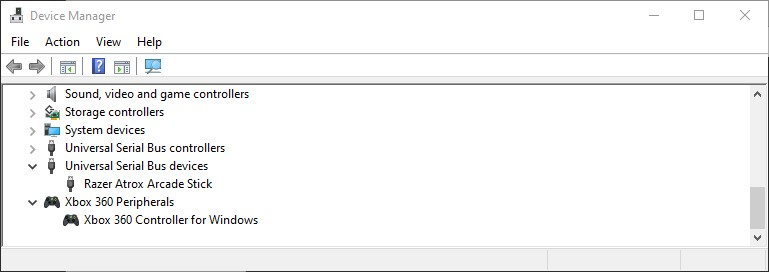
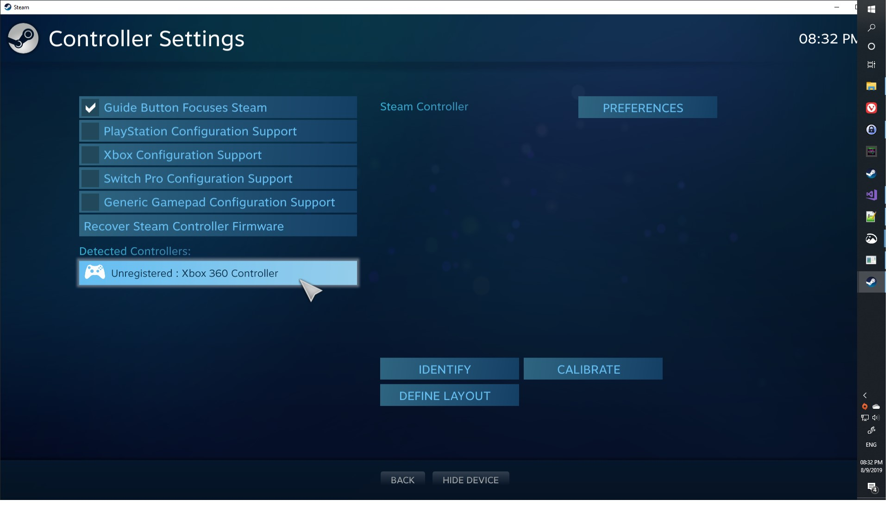
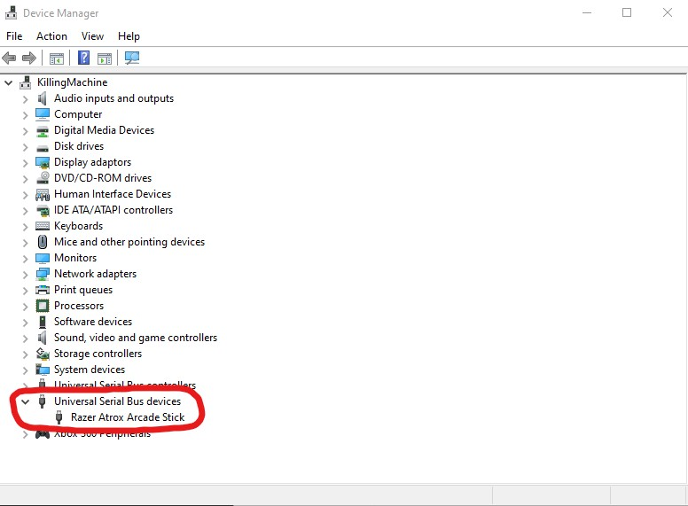

# XBOFS.win
**XBOFS.win** allows you to use your **XBO Fight Stick** controller on Windows without having to install ancient, beta 
drivers and rewire buttons

# Features
* All buttons on supported controllers work, no rewiring or fiddling required
* Multiple supported controllers can be connected
* Supported controllers work in Steam, Windows Store games, etc
* QT5 GUI

# Supported controllers
* Razer Atrox XBO
* Madcatz TE2 XBO

## Contents
1. [Requirements](#requirements)
   1. [Supported controllers](#supported-controllers)
2. [Screenshots and Videos](#screenshots-and-videos)
3. [Installation](#installation)
4. [Updating](#updating)
5. [Usage](#usage)
6. [Uninstallation](#uninstallation)
7. [Support](#support)
8. [FAQ](#faq)
9. [Credits](#credits)

## Requirements

1. Windows 7 or newer
2. 1 or more supported controllers

## Screenshots and Videos

Initial program state when run:

Program state after a supported controller is connected:

Device manager displays the real connected controller as well as the virtual XB360 controller

Steam only sees the virtual XB360 controller

## Installation

01. Browse  to [https://github.com/ViGEm/ViGEmBus/releases/latest](https://github.com/ViGEm/ViGEmBus/releases/latest) and download the 
    latest **VigEmBus** installer. If you are on Windows 7 you also need to download the files in the Windows 7 Prerequisites section
02. Install **VigEmBus** and reboot
03. Browse to [https://github.com/OOPMan/XBOFS.win/releases/latest](https://github.com/OOPMan/XBOFS.win/releases/latest) and download the 
    latest **XBOFS.win.zip** bundle. Extract this bundle somewhere. I recommend the root of your C: drive
04. Browse to [https://zadig.akeo.ie](https://zadig.akeo.ie) and download **Zadig 2.4** to the *XBOFS.win* folder extracted in the previous step
05. Open the [ZaDig WinUSB driver installation guide](/zadig.md) and follow the instructions there to install 
    a **WinUSB** driver for your supported controller. If you own multiple different supported controllers then you must repeat step 5
    for each different supported controller

### Optional
01. Install OpenSSL from [http://slproweb.com/products/Win32OpenSSL.html](http://slproweb.com/products/Win32OpenSSL.html) in order to
    enable the update check functionality. Without this installed the application is unable to check for updates  

## Updating

01. Browser to [https://github.com/OOPMan/XBOFS.win/releases/latest](https://github.com/OOPMan/XBOFS.win/releases/latest) and download 
    the latest **XBOFS.win.zip** bundle. Extract this bundle over your existing folder containg **XBOFS.win**, overwriting any files if asked
02. Restart your computer

## Usage

01. Open the folder that you extracted the **XBOFS.win.zip** bundle into
02. Run **XBOFS.win.qt5.exe** 
03. Connect your supported controller(s)
04. Wait for the interface to indicate your device(s) is **Reading input...**. You may 
    see a pop-up notification about a new XB360 controller(s) being detected, this is normal
05. You can now minimize the **XBOFS.win.qt5.exe** window if you so choose. The application will minimise to the system tray 
    by default
06. You should now be able to play games using your supported controller(s). Any game that supports a standard XB360 
    controller should work, regardless of whether it is a Steam game, Windows store game or any other platform that 
    supports the XB360 controller. Note that the input from the stick is mapped to the D-Pad on the virtual XB360 
    controller not the analog stick
07. When you are done playing simply unplug your device(s) and pack them away. You can leave the application running minimized
    as it does not consume a large amount of memory or CPU time. You can exit the application using the *File* menu or the tray icon

## Uninstallation

01. Hit *Win* \+ *R*
02. Enter *devmgmt.msc* in the Run box and press enter
03. Click *View* and then click *Show hidden devices*
04. Locate the item in the tree labelled *Universal Serial Bus devices*
05. Right-click the item associated with your supported controller and click *Uninstall device*
06. In the dialog box, mark the checkbox labelled *Delete the driver software for this device*
07. Click *Uninstall*
08. Replug your supported controller. It will now use whichever driver was previously configured for it
09. Delete the folder you extracted the **XBOFS.win.zip** bundle into  

## Support

##### XBOFS.win doesn't seem to be able to detect my controller
This usually indicates an issue with the **WinUSB** driver installation. Please check the [ZaDig WinUSB driver installation guide](/zadig.md) and confirm
that when you plug in your controller, **Device Manager** updates to a state as displayed (controller name may differ):

If this does not happen then you should follow the guide from step 1 to see if it fixes the problem. If your problem is still not fixed then please [submit an issue](https://github.com/OOPMan/XBOFS.win/issues)

##### XBOFS.win doesn't seem to be able to create a virtual XB360 Controller
This usually indicates an issue with the **VigEmBus** driver installation. Please confirm that the **Virtual Gamepad Emulation Bus** item appears in **Device Manager**
under the **System Devices** node:

If this item is missing you have not installed **VigEmBus**. Check the [installation guide](#installation) for details on how to do so. If your problem is still not fixed then please [submit an issue](https://github.com/OOPMan/XBOFS.win/issues)

##### When I press buttons on my controller Windows acts like I am hitting keyboard keys or clicking the mouses
This problem occurs when **XBox Configuration Support** is enabled in **Steam**:
1. Open **Steam**
2. Click *Steam* -> *Settings*
3. Click *Controller* -> *General Controller Settings*
4. Uncheck *Xbox Configuration Support*
5. Click *Back*
The controller should now work as expected. If not, please [submit an issue](https://github.com/OOPMan/XBOFS.win/issues)

##### I upgraded to a new version of XBOFS.win and now RetroArch isn't recognising my controllers
This issue occurs if you were running the previous version, exited, upgraded to a new version, started the new version and then started **RetroArch**. 
In order to solve this issue you should reboot after upgrading **XBOFS.win**. If this does not fix the issue, please [submit an issue](https://github.com/OOPMan/XBOFS.win/issues)

##### My problem isn't listed here
Please do one of the following:
1. [Submit an issue](https://github.com/OOPMan/XBOFS.win/issues) on GitHub
2. [Message](https://www.reddit.com/message/compose/?to=OOPManZA) me on Reddit
3. Join the XBOFS.win [subreddit](https://www.reddit.com/r/XBOFS/) and post a question
4. Join the [Nefarius Software Solutions](https://discord.vigem.org/) Discord server and ping **@OOPMan**

## FAQ

##### Why did you develop this piece of software?
Long story short, I bought a Razer Atrox on special and rather than return it I decided to see if I could work out why it didn't work without jumping
through a lot of hoops. The problemn ended up being solvable and here we are. More details can be found [here](https://forums.vigem.org/topic/282/xbo-arcade-sticks-vigem-and-a-whole-ton-of-fun/)

##### Can you support my device?
It's very likely. Take a look at the [device contributor guide](/device_contributor_guide.md) to see how you can collect the data I need to do so...

## Credits

* **Coding**
  * [OOPMan](https://github.com/OOPMan)
* **VigEmBus** and **VigEmClient**
  * [Nefarius](https://github.com/nefarius) (If you have some cash to spare [go give this man some support](https://forums.vigem.org/topic/291/shameless-beggar-post). Without his work on [VigEmBus](https://github.com/ViGEm) **XBOFS.win** would not exist)
  * [!ϻega](https://github.com/megadrago88)
* **Advice**
  * [Nefarius](https://github.com/nefarius)
  * [!ϻega](https://github.com/megadrago88)
  * [evilC](https://github.com/evilC)
  * [Snoothy](https://github.com/Snoothy)
  * [Sylveon](https://github.com/sylveon)
* **XBO Controller Information**
  * [xpad.c](https://github.com/torvalds/linux/blob/master/drivers/input/joystick/xpad.c)
* **Tools**
  * [Device Monitoring Studio](https://www.hhdsoftware.com/device-monitoring-studio)
  * [Microsoft Visual Studio Community 2017](https://visualstudio.microsoft.com)
  * [ZaDig](https://zadig.akeo.ie)
  * [InkScape](https://inkscape.org)
* **Testing**
  * Multiple Atrox support
    * [Manick74](https://www.reddit.com/user/Manick74)
    * [TheDecn](https://www.reddit.com/user/TheDecn)
  * Madcatz TE2 XBO data collection
    * [Fodenn](https://www.reddit.com/user/Fodenn)
* **Graphics**
  * Icon made by Freepik from [www.flaticon.com](https://www.flaticon.com) and modified by [OOPMan](https://github.com/OOPMan)