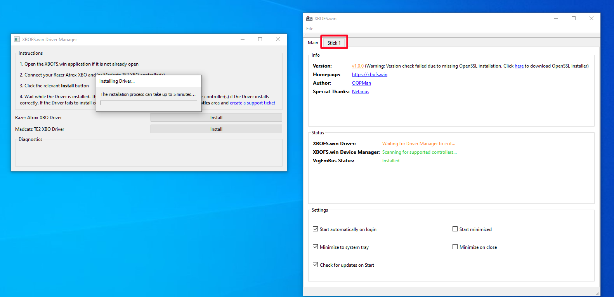

# Installation and First-Run Guide

#### Note for existing users
If you are an existing user running a version of the application that predates the installer the following process
is recommended before proceeding:

01. Open **XBOFS.win** and disable the autostart feature, if it is enabled
02. Exit **XBOFS.win**
03. Delete the existing installation
04. Proceed to step 4 of the [Installation](#installation) instructions

You **do not** need to remove the existing **VigEmBus** or **WinUSB Driver** installations

## Installation
This guide will lead you through the process of installaing VigEmBus and XBOFS.win

01. Download and install the Visual C++ 2015-2019 runtimes:
    
    * [https://aka.ms/vs/16/release/vc_redist.x86.exe](https://aka.ms/vs/16/release/vc_redist.x86.exe)
    * [https://aka.ms/vs/16/release/vc_redist.x64.exe](https://aka.ms/vs/16/release/vc_redist.x64.exe)
    
02. Browse  to [https://github.com/ViGEm/ViGEmBus/releases/latest](https://github.com/ViGEm/ViGEmBus/releases/latest) and download the 
    latest **VigEmBus** installer

03. Run the **VigEmBus** installer application. The installer will request Administrative permissions in order to install the
    **VigEmBus** framework that is used by **XBOFS.win**

04. Browse to [https://github.com/OOPMan/XBOFS.win/releases/latest](https://github.com/OOPMan/XBOFS.win/releases/latest) and download  
    latest **XBOFS.win** installer

05. Run the **XBOFS.win** installer application to install the **XBOFS.win** application

## First Run
01. Run the **XBOFS.win** application and launch the **Driver Manager** using the highlighted link

02. The **Driver Manager** will request Administrative permissions when it launches. Once the **Driver Manager** is running your screen
    should appear as so once you've moved the **Driver Manager** window over:

03. As per the instructions in the **Driver Manager** connect your Razer Atrox XBO or Madcatz TE2 XBO Fight Stick and then click the 
    appropriate button to install the WinUSB driver for your device. A progress dialog should appear and driver installation will begin

04. The **XBOFS.win** application will detect your Fight Stick and this is indicative of a successful WinUSB driver installation

05. Although your Fight Stick should now work correctly, it is best to wait until the progress dialog disappears before closing the 
    **Driver Manager**. You can click the relevant tab in the **XBOFS.win** to view details of the attached Fight Stick while you wait

06. Once the progress dialog has disappeared the *Diagnostics* area of the **Driver Manager** will update. A result of code of 0 or -13 are
    both indicative of success. Other results may indicate an issue. You can now close the **Driver Manager** or, if you have another
    supported **XBO Fight Stick** of a different make (I.e. You own both a Razer Atrox XBO *and* a Madcatz TE2 XBO), return to step 3 and
    repeat the WinUSB driver installation proccess for the other Fight Stick. If you have multiple Razer Atrox XBO *or* Madcatz TE2 XBO Fight 
    Sticks you only need to install the WinUSB driver once per device manufacturer

07. Once the **Driver Manager** has closed the main tab in the **XBOFS.win** application should update to indicate that the WinUSB
    driver has been installed. If you need to access the **Driver Manager** again you can do so from the *File* menu

