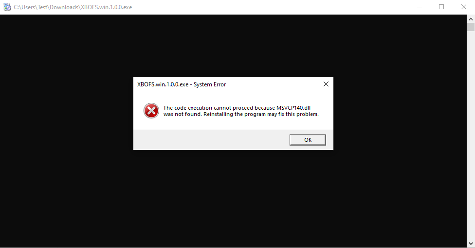
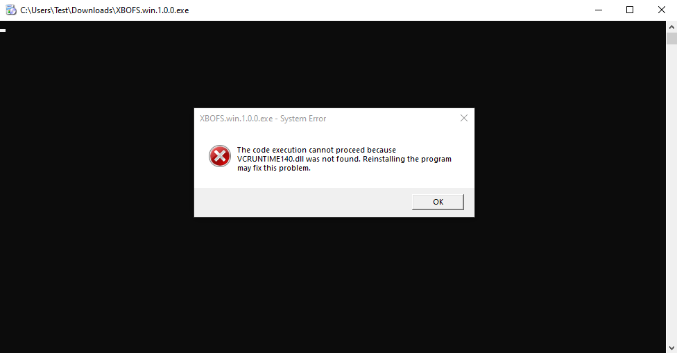
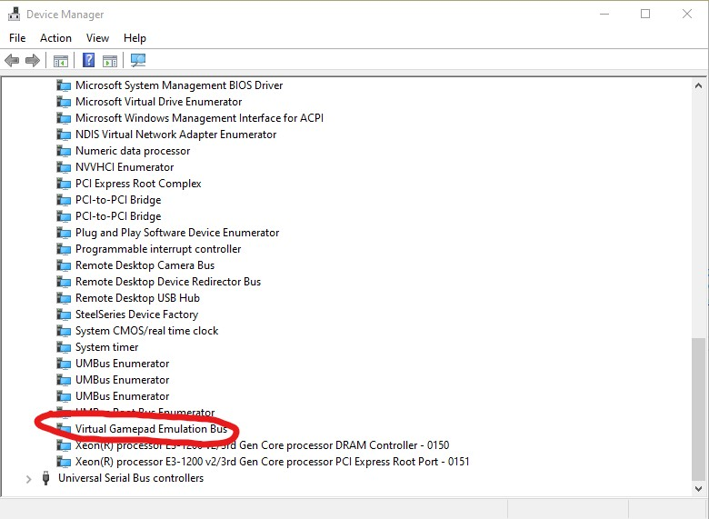

# Troubleshooting

## When I run the **XBOFS.win** installer I get an error about missing DLLs!

Before running the **XBOFS.win** installer you need to install both the 32-bit *and* 64-bit Visual C++ 2015-2019 runtimes. These runtimes
can be downloaded from [https://support.microsoft.com/en-us/topic/the-latest-supported-visual-c-downloads-2647da03-1eea-4433-9aff-95f26a218cc0](https://support.microsoft.com/en-us/topic/the-latest-supported-visual-c-downloads-2647da03-1eea-4433-9aff-95f26a218cc0).

Direct links to the installers are below:
* [https://aka.ms/vs/16/release/vc_redist.x86.exe](https://aka.ms/vs/16/release/vc_redist.x86.exe)
* [https://aka.ms/vs/16/release/vc_redist.x64.exe](https://aka.ms/vs/16/release/vc_redist.x64.exe)

You may be wondering why both the 32-bit and 64-bit versions are required. While **XBOFS.win** is a 64-bit application, the installer
generated by the **Qt Installer Framework** is a 32-bit application.

## When I run **XBOFS.win** I get an error about missing DLLs!
The solution to this error is described above.

## When I try to install the **WinUSB Driver** using the **Driver Manager** I get `libwdi Result Code -11`:
To remedy this issue first attempt the following:
1. Reboot
2. Exit all other programs where possible
3. Make sure the **Windows Control Panel** and/or **Windows Device Manager** applications are closed
4. Unplug any other controllers that may be attached
5. Try the **Driver Manager** process again

If the issue persists then attempt the following:
01. Make sure your **XBO Fight Stick** is connected, the driver installation does not work if it is not connected
02. Make sure the **XBOFS.win** and the **Driver Manager** are not running
03. Navigate to the folder where XBOFS.win is installed
04. Look for the folder inside it named `zadig_driver`
05. Navigate into the `zadig_driver` folder
06. Look for the folder inside it that corresponds to your **XBO Fight Stick**
07. Navigate into the the folder that correspond to your **XBO Fight Stick**
08. Locate the file within the folder named either:
   
   * `razer_atrox_xbo.inf` if your stick is a **Razer Atrox XBO**
   * `madcatz_te2_xbo.inf` if your stick is a **Madcatz TE2 XBO**

09. Right-click on the file and click the *Install* item
10. You should get a message dialog indicating the driver installed and **XBOFS.win** should no work as expected

## **XBOFS.win** doesn't detect **XBO Fight Stick**
This usually indicates an issue with the **WinUSB** driver installation. Check the [installation guide](/installation_guide.md)
and follow the instructions with regards to the **Driver Manager**.

If for some reason the **Driver Manager** is unable to install the **WinUSB** driver then you can try the [ZaDig WinUSB driver installation guide](/zadig.md).

## **XBOFS.win** doesn't seem to be able to create a **Virtual XBox 360 Controller**
This usually indicates an issue with the **VigEmBus** driver installation. Please confirm that the **Virtual Gamepad Emulation Bus** item appears in **Device Manager**
under the **System Devices** node:

If this item is missing you have not installed **VigEmBus**. Check the [installation guide](/installation_guide.md) for details on how to do so.

## When I press buttons on my controller Windows acts like I am hitting keyboard keys or clicking the mouse buttons
This problem occurs when **XBox Configuration Support** is enabled in **Steam**:
1. Open **Steam**
2. Click *Steam* -> *Settings*
3. Click *Controller* -> *General Controller Settings*
4. Uncheck *Xbox Configuration Support*
5. Click *Back*

The controller should now work as expected.

## I upgraded to a new version of **XBOFS.win** and now ***RetroArch** isn't recognising my controllers
This issue occurs if you were running the previous version, exited, upgraded to a new version, started the new version and then started **RetroArch**. 
In order to solve this issue you should reboot after upgrading **XBOFS.win**. 

## Windows Security flags **XBOFS.win** as *Behavior:Win32/Persistence* and deletes parts of the application!
This error has been observed when configuring **XBOFS.win** to start automatically when logging in to Windows, usually when you have it installed
to a location outside our user directory. This seems to result from **Windows Security** being overly cautious with regards to the behaviour of 
the application. In order to solve this problem you will need to do the following:
1. Open the *Windows Settings* screen
2. Click the *Update & Security* item
3. Click the *Windows Security* item
4. Click the *Open Windows Security* button
5. Click the *Virus & threat protection* item
6. Click the *Protection History* item
7. Locate the *Threat Quarantined* item(s) in the *Protection History* list that correspond to **XBOFS.win**. This can be done by checking the
   timestamp listed and correlating it with your enabling of the autostart feature. Confirm the item(s) by clicking on the item and then checking
   the *Affected Items* list for files that related to **XBOFS.win**
8. For each item that has been created for **XBOFS.win** you will need to click the *Actions* drop-down button and select the *Restore* item
9. In the event that the above actions do not restore the **XBOFS.win** application, use the *Add or Remove programs* interface from
   *Windows Settings* to uninstall **XBOFS.win** and then reinstall the application to the default suggested path

## My problem isn't listed here or a solution above did not work for me
Please do one of the following:
1. [Submit an issue](https://github.com/OOPMan/XBOFS.win/issues) on GitHub
2. [Message](https://www.reddit.com/message/compose/?to=OOPManZA) me on Reddit
3. Join the **XBOFS.win** [subreddit](https://www.reddit.com/r/XBOFS/) and post a question
4. Join the [Nefarius Software Solutions](https://discord.vigem.org/) Discord server and ping **@OOPMan**

