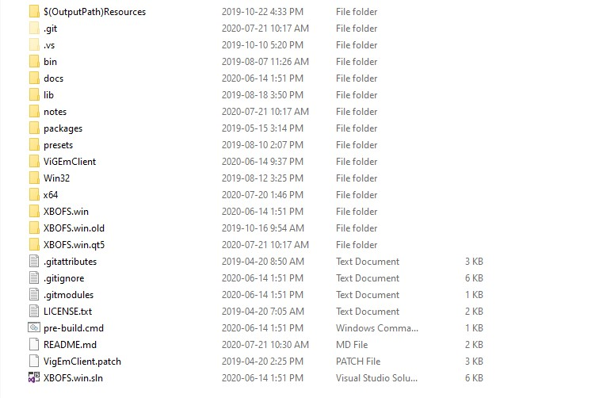

# Troubleshooting

##### I extracted **XBOFS.win.zip** but can't find **XBOFS.win.qt5.exe**
You may have accidentally download the source code. If the contents of the zip file look like this:

then you have downloaded the source code by mistake. Head back to step 3 of the [installation guide](#installation) and make sure the download the file **XBOFS.win.zip**.
Do not download **Source Code (zip)** or **Source Code (tar.gz)**, these do not contain the application.

##### XBOFS.win doesn't seem to be able to detect my controller
This usually indicates an issue with the **WinUSB** driver installation. Please check the [ZaDig WinUSB driver installation guide](/zadig.md) and confirm
that when you plug in your controller, **Device Manager** updates to a state as displayed (controller name may differ):

If this does not happen then you should follow the guide from step 1 to see if it fixes the problem. If your problem is still not fixed then please [submit an issue](https://github.com/OOPMan/XBOFS.win/issues)

##### XBOFS.win doesn't seem to be able to create a virtual XB360 Controller
This usually indicates an issue with the **VigEmBus** driver installation. Please confirm that the **Virtual Gamepad Emulation Bus** item appears in **Device Manager**
under the **System Devices** node:

If this item is missing you have not installed **VigEmBus**. Check the [installation guide](#installation) for details on how to do so. If your problem is still not fixed then please [submit an issue](https://github.com/OOPMan/XBOFS.win/issues)

##### When I press buttons on my controller Windows acts like I am hitting keyboard keys or clicking the mouses
This problem occurs when **XBox Configuration Support** is enabled in **Steam**:
1. Open **Steam**
2. Click *Steam* -> *Settings*
3. Click *Controller* -> *General Controller Settings*
4. Uncheck *Xbox Configuration Support*
5. Click *Back*
The controller should now work as expected. If not, please [submit an issue](https://github.com/OOPMan/XBOFS.win/issues)

##### I upgraded to a new version of XBOFS.win and now RetroArch isn't recognising my controllers
This issue occurs if you were running the previous version, exited, upgraded to a new version, started the new version and then started **RetroArch**. 
In order to solve this issue you should reboot after upgrading **XBOFS.win**. If this does not fix the issue, please [submit an issue](https://github.com/OOPMan/XBOFS.win/issues)

##### My problem isn't listed here
Please do one of the following:
1. [Submit an issue](https://github.com/OOPMan/XBOFS.win/issues) on GitHub
2. [Message](https://www.reddit.com/message/compose/?to=OOPManZA) me on Reddit
3. Join the XBOFS.win [subreddit](https://www.reddit.com/r/XBOFS/) and post a question
4. Join the [Nefarius Software Solutions](https://discord.vigem.org/) Discord server and ping **@OOPMan**

