# ZaDig WinUSB Driver Installation Guide

01. Check Device Manager and confirm your supported controller is being detected by Windows. It should appear as a 
    *Xbox Gaming Device* under the *Xbox Peripherals* node. If it does not appear here you may still continue with 
    the process but there is a chance it may not work...

    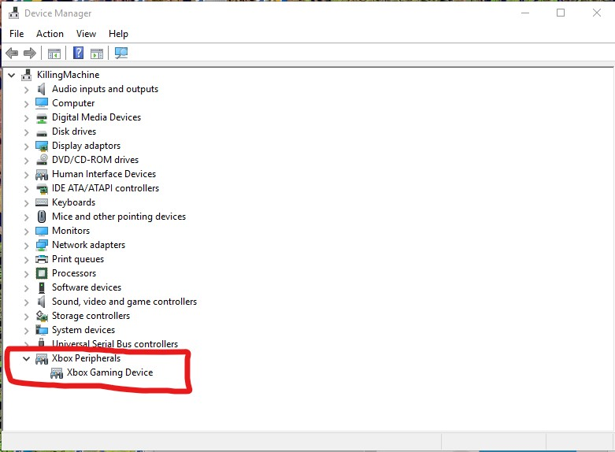
02. The latest version of **ZaDig** should be downloaded to your system and placed in the location you extracted the **XBOFS.win.zip** bundle to

    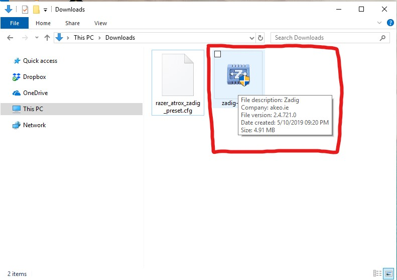
03. Run **ZaDig**. You will probably get a pop-up as it wants to run as **Administrator**. Allow it. Once start it should look like this

    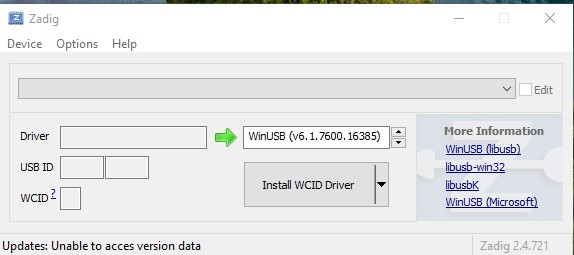
04. Click *Device*. Click *Load Preset Device*

    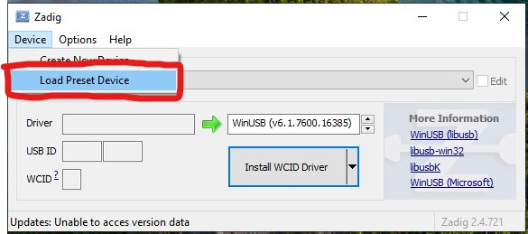
05. Navigate to the *zadig_presets* folder and select the appropriate preset for your device

    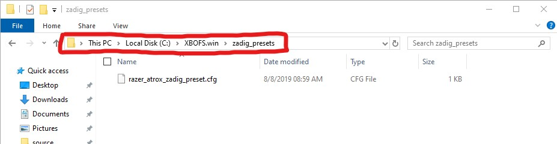
06. **ZaDig** should now appear as follows (Device name should match that of your controller)

    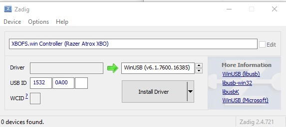
07. Ensure the highlighted box is showing **WinUSB**. If it shows something else then click on the little arrows next to it until it displays WinUSB

    
08. Click the small arrow next to the *Install Driver* button. **DO NOT** click the *Install Driver* button!

    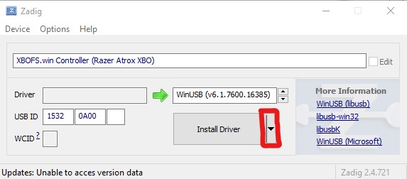
09. Click the *Extract Files (Don't Install)* option

    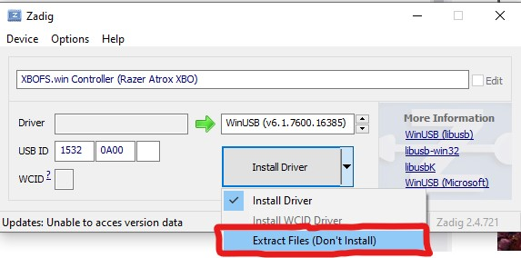
10. ZaDig should now appear as follows. **DO NOT** click the *Extract Files* button yet!

    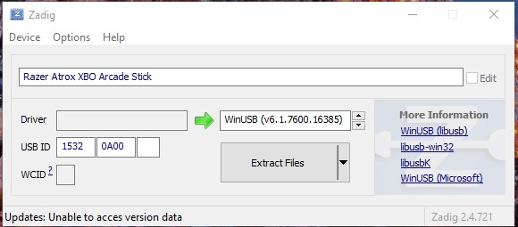
11. Click *Options*. Click *Advanced Mode*

    
12. Click the highlighted icon next to the *Extract Files* button

    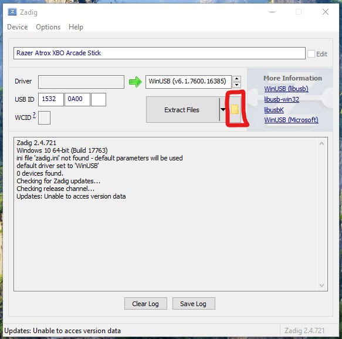
13. Navigate to the *zadig_driver*, click the folder for your controller and click *Select Folder*

    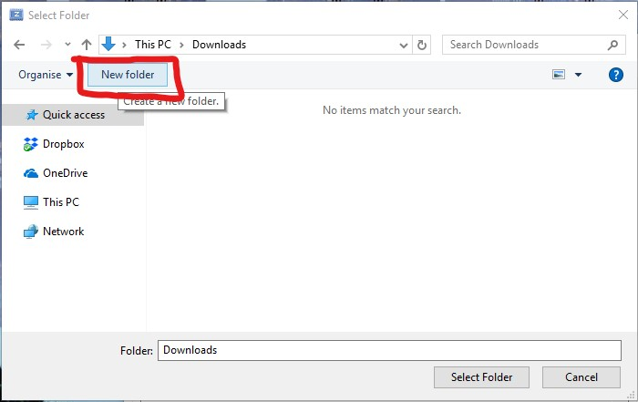
14. Confirm in the log area that **ZaDig** is going to use the selected folder as the extraction directory

    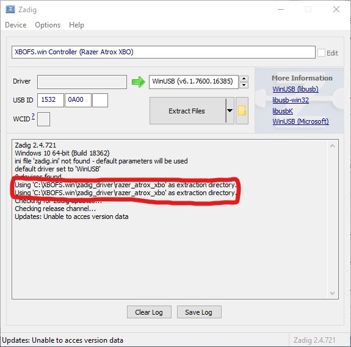
15. Now, finally, click the *Extract Files* button

    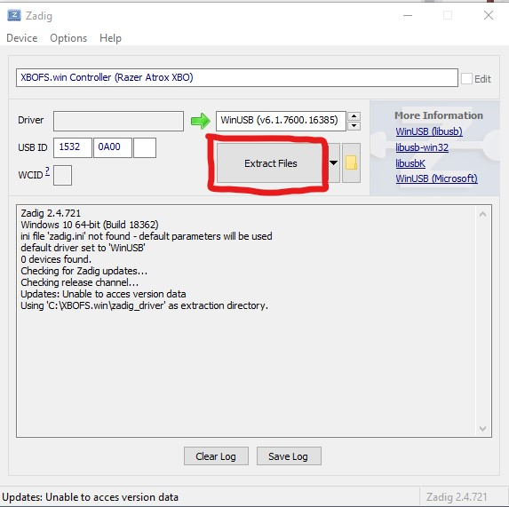
16. Wait and when it's done the log output should appear as follows along with a message at the bottom of the window stating that the files 
    were successfully extracted. You can now close **ZaDig**

    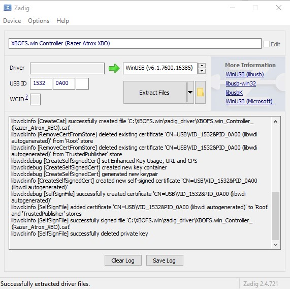
17. Open the correct folder within the *zadig_driver* folder

    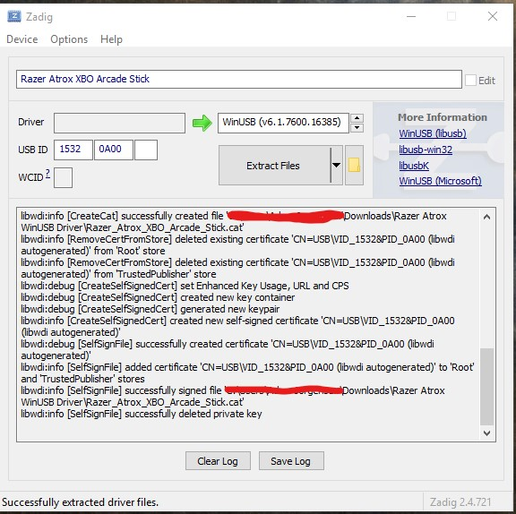
18. Right-click on the *Setup information* file (The icon is a white page with a grey gear)

    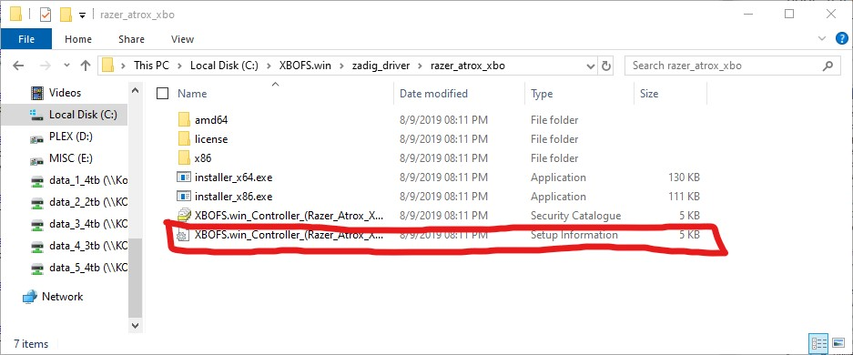
19. Click *Install*

    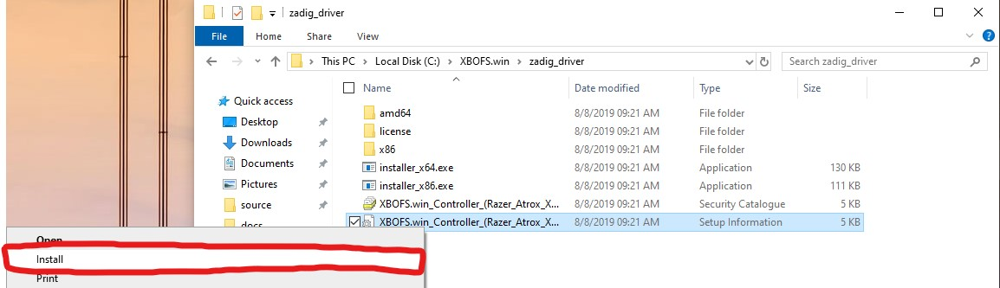
20. The driver should install correctly

    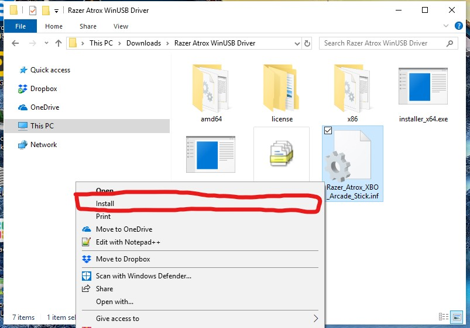
21. If it does not, you will need to follow the instructions at 
    http://jbcomp.com/disable-device-driver-signing-in-windows-10/ to disable the requirement for signed device drivers and retry this from step 18
